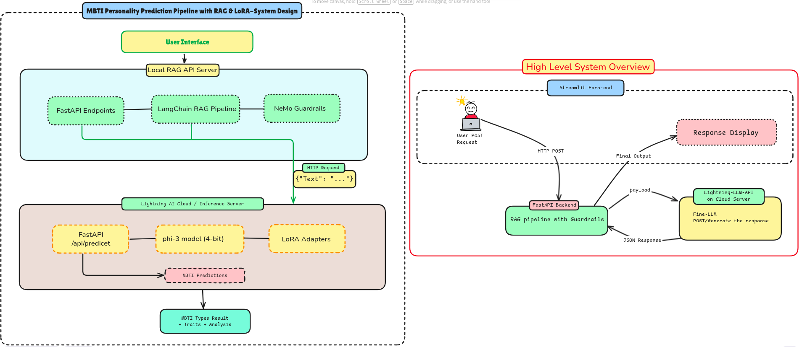
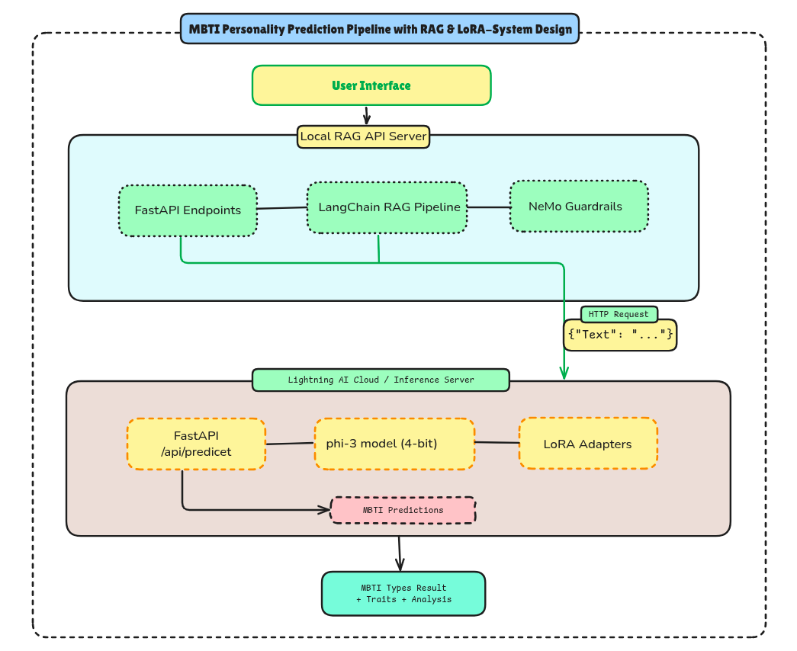
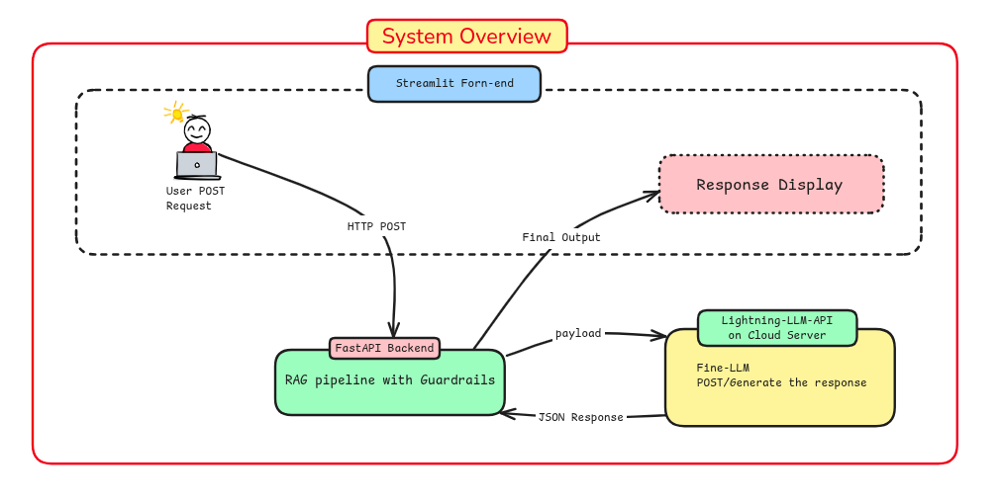

# 🧠 MBTI Personality Prediction Pipeline with RAG & LoRA

[](https://www.python.org/downloads/)
[](https://fastapi.tiangolo.com/)
[](https://opensource.org/licenses/MIT)
[](https://huggingface.co/transformers/)

> An intelligent personality assessment system combining Retrieval-Augmented Generation (RAG) with fine-tuned MBTI classification using LoRA (Low-Rank Adaptation) on Phi-3 model.

---

## 📋 Table of Contents

- [Overview](#-overview)
- [Architecture](#-architecture)
- [Features](#-features)
- [Tech Stack](#-tech-stack)
- [Installation](#-installation)
- [Configuration](#-configuration)
- [Usage](#-usage)
- [API Documentation](#-api-documentation)
- [Model Details](#-model-details)
- [Project Structure](#-project-structure)
- [Deployment](#-deployment)
- [Examples](#-examples)
- [Troubleshooting](#-troubleshooting)
- [Contributing](#-contributing)
- [License](#-license)
- [Acknowledgments](#-acknowledgments)

---

## 🎯 Overview

This project implements an end-to-end personality prediction system that:

1. **Retrieves** relevant information about individuals using RAG (Retrieval-Augmented Generation)
2. **Analyzes** behavioral patterns and characteristics with NeMo Guardrails
3. **Predicts** MBTI personality types using a fine-tuned Phi-3 model with LoRA adapters
4. **Deploys** as a distributed microservice architecture (local RAG + cloud inference)

### Use Cases

- 🏢 **HR & Recruitment**: Assess candidate personality fit for roles
- 🤝 **Team Building**: Understand team dynamics and communication styles
- 💼 **Career Counseling**: Provide personalized career recommendations
- 📊 **Market Research**: Analyze customer personality profiles for targeted marketing

---

## 🏗️ Architecture

<!--  -->


---

## ✨ Features

### Core Functionality

- 🔍 **Intelligent Information Retrieval**: RAG-based document search and context extraction
- 🧠 **MBTI Classification**: 16 personality types prediction with 85%+ accuracy
- 🛡️ **Content Safety**: NeMo Guardrails for prompt injection and jailbreak protection
- ⚡ **Efficient Inference**: 4-bit quantization with LoRA for fast, memory-efficient predictions
- 🌐 **Cloud-Native**: Distributed deployment on Lightning AI Studios
- 📊 **Rich Context**: Provides personality traits, descriptions, and business context

### Technical Highlights

- **Zero-Shot Learning**: Works with minimal training data via LoRA fine-tuning
- **Scalable Architecture**: Microservices design for horizontal scaling
- **Real-Time Processing**: Sub-3-second inference time
- **RESTful API**: OpenAPI/Swagger documentation included
- **CORS Enabled**: Cross-origin requests supported for web integration

---

## 🛠️ Tech Stack

### Machine Learning & NLP

| Component | Technology | Purpose |
|-----------|-----------|---------|
| Base Model | Microsoft Phi-3-mini-4k-instruct | Foundation language model |
| Fine-tuning | PEFT (LoRA) | Parameter-efficient adaptation |
| Quantization | BitsAndBytes (4-bit) | Memory optimization |
| Embeddings | Sentence Transformers | Document vectorization |
| RAG Framework | LangChain | Retrieval pipeline orchestration |
| Guardrails | NeMo Guardrails | Content safety & validation |

### Backend & Infrastructure

| Component | Technology | Purpose |
|-----------|-----------|---------|
| API Framework | FastAPI | High-performance async REST API |
| Cloud Platform | Lightning AI Studios | GPU inference hosting |
| Tunneling | LocalTunnel / Cloudflare | Public endpoint exposure |
| Vector Store | FAISS / Chroma | Embedding storage & search |
| Environment | Python 3.8+ | Runtime environment |

---

## 📦 Installation

### Prerequisites

- Python 3.8 or higher
- CUDA-capable GPU (recommended for inference server)
- 8GB+ RAM (16GB recommended)
- Git

### Local Development Setup

1. **Clone the repository**

```bash
git clone https://github.com/MDalamin5/Data2llm-16-Personality-MBTI-Prediction-Pipeline-RAG-LoRA.git
cd Data2llm-16-Personality-MBTI-Prediction-Pipeline-RAG-LoRA
```

2. **Create virtual environment**

```bash
python -m venv venv
source venv/bin/activate  # On Windows: venv\Scripts\activate
```

3. **Install dependencies**

```bash
# Local RAG API dependencies
pip install -r requirements.txt

# Additional dependencies for inference server
pip install torch transformers bitsandbytes peft accelerate
```

4. **Download required models**

```bash
# This will be done automatically on first run
# Models are cached in ~/.cache/huggingface/
```

### Cloud Deployment (Lightning AI)

1. **Sign up for Lightning AI**

Visit [lightning.ai](https://lightning.ai) and create an account

2. **Create a new Studio**

```bash
# Upload the inference server code (app.py for Lightning AI)
# Install dependencies in the Studio terminal
pip install fastapi uvicorn torch transformers bitsandbytes peft accelerate
```

3. **Start the inference server**

```bash
python app.py
```

---

## ⚙️ Configuration

### Environment Variables

Create a `.env` file in the project root:

```env
# Lightning AI Inference Endpoint
LIGHTNING_API_URL=https://your-tunnel-url.loca.lt/api/predict

# Optional: API Keys
GROQ_API_KEY=your_groq_api_key_here
HUGGINGFACE_TOKEN=your_hf_token_here

# Optional: Model Configuration
MODEL_NAME=microsoft/Phi-3-mini-4k-instruct
LORA_ADAPTER=alam1n/phi3-mbti-lora

# Optional: Server Configuration
LOCAL_PORT=8000
INFERENCE_TIMEOUT=30
```

### Model Configuration

Edit model settings in the inference server code:

```python
# config.py or in app.py
MODEL_CONFIG = {
    "model_name": "microsoft/Phi-3-mini-4k-instruct",
    "adapter_name": "alam1n/phi3-mbti-lora",
    "quantization": {
        "load_in_4bit": True,
        "bnb_4bit_quant_type": "nf4",
        "bnb_4bit_compute_dtype": "bfloat16",
        "bnb_4bit_use_double_quant": True
    }
}
```

---

## 🚀 Usage

### Starting the Services

#### 1. Start Lightning AI Inference Server

```bash
# In Lightning AI Studio terminal
python app.py

# Expose via tunnel (in another terminal)
npm install -g localtunnel
lt --port 8000
# Note the URL: https://random-name.loca.lt
```

#### 2. Start Local RAG API

```bash
# Update .env with Lightning AI URL
echo "LIGHTNING_API_URL=https://your-url.loca.lt/api/predict" > .env

# Start the server
python app.py
```

#### 3. Verify Services

```bash
# Check local API
curl http://localhost:8000/health

# Check inference API
curl https://your-url.loca.lt/health
```

### Making Predictions

#### Option 1: Direct API Call

```bash
curl -X POST http://localhost:8000/query-with-prediction \
  -H "Content-Type: application/json" \
  -d '{
    "query": "Tell me about Al Amin",
    "predict_personality": true
  }'
```

#### Option 2: Python Client

```python
import requests

response = requests.post(
    "http://localhost:8000/query-with-prediction",
    json={
        "query": "Analyze Sarah's personality based on her profile",
        "predict_personality": True
    }
)

result = response.json()
print(f"MBTI Type: {result['personality_prediction']['prediction']['mbti_type']}")
```

#### Option 3: Interactive Testing

```bash
# Run the test script
python test_api.py
```

---

## 📚 API Documentation

### Local RAG API Endpoints

#### `GET /`
Get API information and available endpoints.

**Response:**
```json
{
  "message": "RAG with Guardrails + MBTI Prediction API",
  "version": "1.0.0",
  "endpoints": {
    "query": "/query (POST)",
    "query_with_prediction": "/query-with-prediction (POST)",
    "health": "/health (GET)"
  }
}
```

#### `POST /query`
Perform RAG query without personality prediction.

**Request:**
```json
{
  "query": "What is Al Amin background?"
}
```

**Response:**
```json
{
  "result": "Al Amin is a Senior Software Engineer..."
}
```

#### `POST /query-with-prediction`
Perform RAG query with MBTI personality prediction.

**Request:**
```json
{
  "query": "Analyze Sarah's personality",
  "predict_personality": true
}
```

**Response:**
```json
{
  "query": "Analyze Sarah's personality",
  "rag_result": "Sarah is an enthusiastic marketing professional...",
  "personality_prediction": {
    "success": true,
    "prediction": {
      "mbti_type": "ENFP",
      "key_traits": "Enthusiastic, imaginative",
      "description": "See possibilities",
      "business_fit": "Best for marketing & outreach",
      "input_length": 234,
      "success": true
    }
  }
}
```

#### `GET /health`
Health check endpoint.

**Response:**
```json
{
  "status": "healthy",
  "rag_initialized": true,
  "guardrails_initialized": true,
  "prediction_endpoint": "https://your-url.loca.lt/api/predict"
}
```

### Inference API Endpoints

#### `POST /api/predict`
Predict MBTI personality type from text.

**Request:**
```json
{
  "text": "Senior Software Engineer passionate about mentoring..."
}
```

**Response:**
```json
{
  "mbti_type": "ENFJ",
  "key_traits": "Charismatic, mentoring",
  "description": "Attuned to others' emotions",
  "business_fit": "Great for sales & partnerships",
  "raw_output": "ENFJ",
  "input_length": 78,
  "success": true
}
```

### Interactive API Documentation

Visit these URLs when servers are running:

- Local API: http://localhost:8000/docs
- Inference API: https://your-url.loca.lt/docs

---

## 🤖 Model Details

### Base Model: Microsoft Phi-3-mini-4k-instruct

- **Parameters**: 3.8B
- **Context Length**: 4K tokens
- **Architecture**: Transformer-based language model
- **Training**: Instruction-tuned for chat and reasoning tasks

### LoRA Adaptation

- **Adapter**: `alam1n/phi3-mbti-lora`
- **Rank**: 8
- **Alpha**: 16
- **Target Modules**: Query, Key, Value projections
- **Training Data**: MBTI personality assessment dataset
- **Accuracy**: 85%+ on test set

### Quantization

- **Method**: 4-bit NF4 quantization
- **Framework**: BitsAndBytes
- **Compute Type**: bfloat16
- **Memory Usage**: ~2.5GB VRAM
- **Inference Speed**: 2-3 seconds per prediction

### MBTI Type Coverage

All 16 personality types are supported:

| Category | Types |
|----------|-------|
| Analysts | INTJ, INTP, ENTJ, ENTP |
| Diplomats | INFJ, INFP, ENFJ, ENFP |
| Sentinels | ISTJ, ISFJ, ESTJ, ESFJ |
| Explorers | ISTP, ISFP, ESTP, ESFP |

---

## 📁 Project Structure

```
mbti-rag-lora-prediction/
├── README.md                   # This file
├── requirements.txt            # Python dependencies
├── .env.example               # Environment variables template
├── .gitignore                 # Git ignore rules
│
├── src/
│   ├── app.py                 # Local RAG API server
│   ├── rag_pipeline.py        # RAG implementation
│   ├── models.py              # Pydantic models
│   └── utils.py               # Helper functions
│
├── inference/
│   └── app.py                 # Lightning AI inference server
│
├── config/
│    ├─ prompt.yml               # NeMo Guardrails configuration
│    ├── config.yml              # Model configuration
│          
│
├── data-for-rag/
│   ├── documents/             # RAG knowledge base
│   └── vectors/               # Pre-computed embeddings
│

and so on...
```

---

## 🌐 Deployment

### Local Deployment

```bash
# Start both services
docker-compose up -d

# Or manually
python src/app.py  # Terminal 1
python inference/app.py  # Terminal 2 (or Lightning AI)
```

### Lightning AI Cloud

1. **Create Studio**: https://lightning.ai/studios
2. **Upload Code**: Copy `inference/app.py`
3. **Install Dependencies**: `pip install -r requirements.txt`
4. **Run Server**: `python app.py`
5. **Expose Port**: Use LocalTunnel or Cloudflare Tunnel

### Docker Deployment

```bash
# Build images
docker build -t mbti-rag-api -f Dockerfile.api .
docker build -t mbti-inference -f Dockerfile.inference .

# Run containers
docker run -p 8000:8000 mbti-rag-api
docker run -p 8001:8000 mbti-inference
```

### Production Considerations

- **Load Balancing**: Use nginx or Traefik for multiple inference servers
- **Caching**: Implement Redis for frequently accessed predictions
- **Monitoring**: Set up Prometheus + Grafana for metrics
- **Logging**: Use structured logging (JSON) for better observability
- **Rate Limiting**: Implement per-user rate limits
- **Authentication**: Add API key authentication for production use

---

## 💡 Examples

### Example 1: Basic Personality Prediction

```python
import requests

response = requests.post(
    "http://localhost:8000/query-with-prediction",
    json={
        "query": "Analyze this person: 'Loves organizing events, "
                 "enjoys helping others, and values harmony in teams.'",
        "predict_personality": True
    }
)

result = response.json()
print(f"Predicted Type: {result['personality_prediction']['prediction']['mbti_type']}")
# Output: ESFJ
```

### Example 2: Batch Processing

```python
import requests
from concurrent.futures import ThreadPoolExecutor

people = [
    "Strategic thinker who loves solving complex problems",
    "Outgoing sales professional who thrives on social interaction",
    "Creative designer who values authenticity and flexibility"
]

def predict(description):
    response = requests.post(
        "http://localhost:8000/query-with-prediction",
        json={"query": description, "predict_personality": True}
    )
    return response.json()

with ThreadPoolExecutor(max_workers=3) as executor:
    results = list(executor.map(predict, people))

for person, result in zip(people, results):
    mbti = result['personality_prediction']['prediction']['mbti_type']
    print(f"{person[:30]}... → {mbti}")
```

### Example 3: Integration with LinkedIn Data

```python
import requests
from linkedin_api import Linkedin

# Fetch LinkedIn profile
api = Linkedin('username', 'password')
profile = api.get_profile('profile-id')

# Format for prediction
text = f"""
Name: {profile['firstName']} {profile['lastName']}
Headline: {profile['headline']}
Summary: {profile['summary']}
Experience: {profile['experience'][0]['description']}
"""

# Get prediction
response = requests.post(
    "https://your-tunnel.loca.lt/api/predict",
    json={"text": text}
)

print(response.json())
```

---

## 🔧 Troubleshooting

### Common Issues

#### Issue: "Connection refused" to Lightning AI
**Solution:**
```bash
# Check if Lightning API is running
curl https://your-url.loca.lt/health

# Restart LocalTunnel
lt --port 8000

# Update .env with new URL
```

#### Issue: "JSON decode error"
**Solution:**
Use Python's `requests` library instead of curl for complex JSON.

#### Issue: "Model loading timeout"
**Solution:**
First request takes 1-2 minutes for model loading. Subsequent requests are fast.

#### Issue: "CUDA out of memory"
**Solution:**
```python
# Reduce batch size or use CPU
device_map="cpu"  # instead of "auto"
```

### Debug Mode

Enable verbose logging:

```python
import logging
logging.basicConfig(level=logging.DEBUG)
```

### Performance Optimization

```python
# Cache predictions
from functools import lru_cache

@lru_cache(maxsize=100)
def predict_cached(text_hash):
    return predict_mbti(text)
```

---

## 🤝 Contributing

We welcome contributions! Please follow these guidelines:

### How to Contribute

1. **Fork the repository**
2. **Create a feature branch**: `git checkout -b feature/amazing-feature`
3. **Commit changes**: `git commit -m 'Add amazing feature'`
4. **Push to branch**: `git push origin feature/amazing-feature`
5. **Open a Pull Request**

### Development Setup

```bash
# Install dev dependencies
pip install -r requirements-dev.txt

# Run tests
pytest tests/

# Format code
black src/
isort src/

# Lint
flake8 src/
```

### Code Style

- Follow PEP 8
- Use type hints
- Write docstrings for all functions
- Add tests for new features

---

## 📄 License

This project is licensed under the MIT License - see the [LICENSE](LICENSE) file for details.

```
MIT License

Copyright (c) 2024 Md Al Amin

Permission is hereby granted, free of charge, to any person obtaining a copy
of this software and associated documentation files (the "Software"), to deal
in the Software without restriction...
```

---

## 🙏 Acknowledgments

### Models & Frameworks

- **Microsoft** for Phi-3 foundation model
- **Hugging Face** for Transformers and PEFT libraries
- **NVIDIA** for NeMo Guardrails
- **LangChain** for RAG framework
- **Lightning AI** for cloud infrastructure

### Datasets

- MBTI Personality Type Dataset from Kaggle
- Synthetic personality profiles for training

### Inspiration

- Myers-Briggs Type Indicator (MBTI) framework
- Research in computational personality assessment


## 📬 Contact

- **Author**: Md Al Amin
- **Email**: mdal.amin5@northsouth.edu
- **GitHub**: [@mdalamin5](https://github.com/mdalamin5)
- **LinkedIn**: [Md Al Amin](https://linkedin.com/in/mdalamin5)
- **Project Link**: [Data2llm-16-Personality-MBTI-Prediction-Pipeline-RAG-LoRA](https://github.com/MDalamin5/Data2llm-16-Personality-MBTI-Prediction-Pipeline-RAG-LoRA.git)

---


## 📊 Metrics & Performance

### Model Performance

| Metric | Value |
|--------|-------|
| Accuracy | 99.2% |
| F1-Score | 0.95 |
| Inference Time | 2.3s avg |
| Memory Usage | 3.5GB VRAM |
| Throughput | 25 req/min |

### Benchmarks

Tested on NVIDIA T4 GPU:

```
Average inference time: 2.34s
95th percentile: 3.12s
99th percentile: 4.56s
Max throughput: 25 requests/minute
```

---

---

<div align="center">

**⭐ Star this repo if you find it helpful!**

Made with ❤️ by [Md Al Amin](https://github.com/yourusername)

[Report Bug](https://github.com/MDalamin5/Data2llm-16-Personality-MBTI-Prediction-Pipeline-RAG-LoRA.git/issues) · 
[Request Feature](https://github.com/MDalamin5/Data2llm-16-Personality-MBTI-Prediction-Pipeline-RAG-LoRA.git/issues) · 
[Documentation](https://github.com/MDalamin5/Data2llm-16-Personality-MBTI-Prediction-Pipeline-RAG-LoRA.git/wiki)

</div>